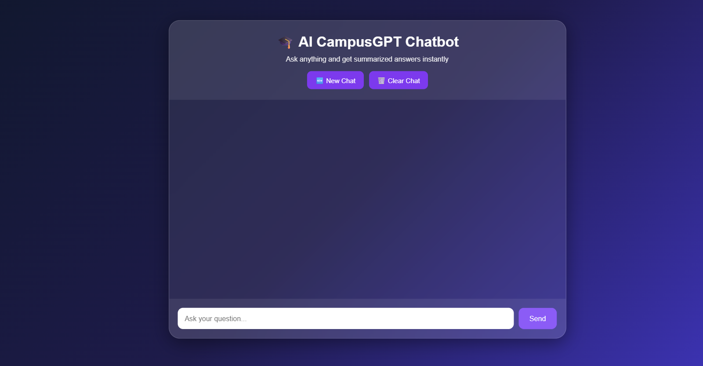
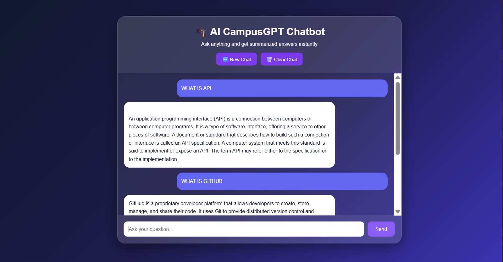

#  AI CampusGPT Chatbot

A professional AI-powered campus assistant chatbot developed using Python and modern web technologies. The chatbot helps students by answering academic queries, providing campus-related information, and delivering instant responses through an interactive chat interface.

# Live Demo

## https://ai-campusgpt-chatbot.onrender.com

---

##  Project Overview

AI CampusGPT Chatbot is an intelligent chatbot designed to assist students with academic and campus-related information. The system provides a user-friendly conversational interface that allows users to interact naturally and receive quick, accurate responses.

The chatbot enhances student engagement by providing instant assistance without requiring manual intervention.


##  Features

###  AI-Powered Chatbot

* Interactive conversation interface
* Real-time response generation
* User-friendly chatbot experience

###  Student Assistance

* Answers academic queries
* Provides campus-related information
* Supports quick information retrieval

###  User Interface

* Clean and responsive design
* Easy navigation
* Interactive chat window
* Mobile-friendly layout

###  System Features

* Fast response handling
* Organized project structure
* Scalable architecture
* Easy deployment


##  Project Screenshots

### Chatbot Interface



### Chatbot Response




##  Tech Stack

### Backend

* Python

### Frontend

* HTML5
* CSS3
* JavaScript

### Frameworks & Libraries

* Flask
* OpenAI API / AI Integration

### Tools & Platforms

* Git
* GitHub
* VS Code


##  Project Structure

```text
AI_CampusGPT_Chatbot/
│
├── app.py
├── requirements.txt
├── README.md
│
├── static/
│
├── templates/
│
└── screenshots/
    ├── chatbot_interface.png
    └── chatbot_response.png
```


##  Installation Guide

### Clone the Repository

```bash
git clone https://github.com/chussainbee2026-commits/AI_CampusGPT_Chatbot.git
```

### Navigate to Project Folder

```bash
cd AI_CampusGPT_Chatbot
```

### Install Dependencies

```bash
pip install -r requirements.txt
```

### Run the Application

```bash
python app.py
```


##  Usage

1. Launch the application.
2. Open the chatbot interface.
3. Enter your query.
4. Receive instant AI-generated responses.
5. Continue the conversation as needed.


##  Benefits

* Quick access to campus information
* Improved student engagement
* Reduced manual support workload
* Easy-to-use conversational interface
* Fast and reliable responses


##  Future Enhancements

* Voice-based interaction
* Multi-language support
* Student login integration
* Personalized recommendations
* Advanced AI capabilities
* Mobile application support

## Authors

Hussain Bee & Akram Hussain

Aspiring Software Developers | Python Enthusiasts | Data Analytics & AI Learners

Passionate about Software Development, Data Analytics, Artificial Intelligence, Web Technologies, Automation, and Problem Solving. Dedicated to continuous learning and building innovative, scalable, and impactful solutions that deliver exceptional user experiences.

##  Support

If you found this project useful, consider giving it a * star on GitHub.

 
